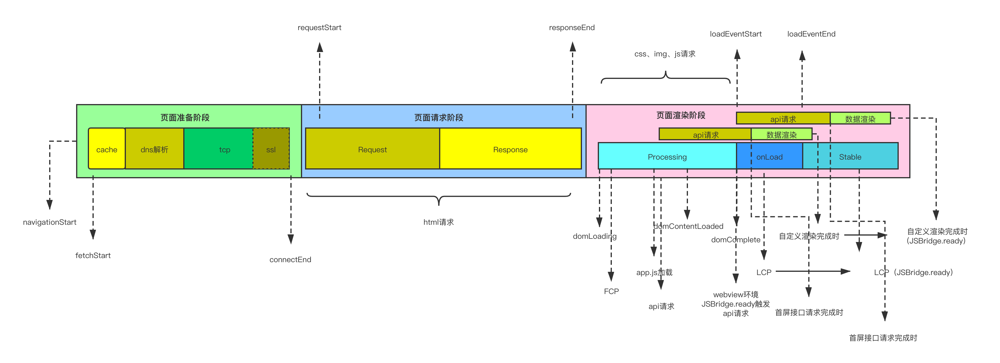
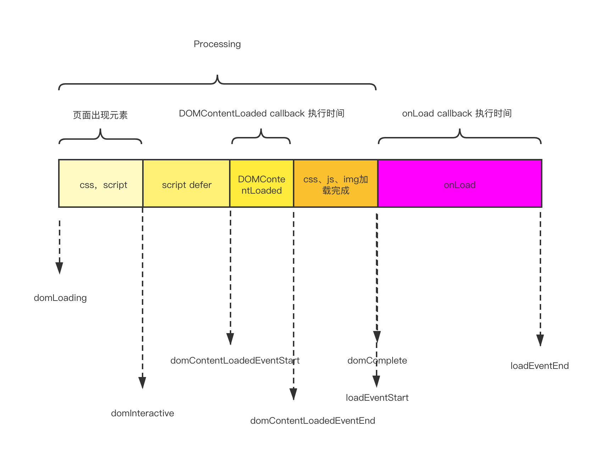

## 指标定义

+ w3c 定义
  

+ 在w3c基础上的细分（对目前Spa页面来说，大致是这样的）
  

+ processing及onLoad的具体步骤
  

## 如何分析指标

当我们收集到了一些指标后，我们需要对指标做出一些反馈。 譬如，FCP花费很长时间，该如何优化？LCP花费很长时间，改如何优化？

所以收集了指标之后，更好得分析指标，是让性能监控变得更有意义的关键。

这里以FCP来说明下，指标如何分析： 当前我们发现FCP花费时间很长时，分析步骤如下：

+ 页面准备阶段
  - 查看dnsLookup的耗时
  - 查看Tcp连接耗时
+ 页面请求阶段
  - 查看html请求返回耗时
+ 页面解析渲染阶段
  - 检查script是否有阻塞渲染
  - 检查第一个元素渲染的时机是否偏晚
  - 检查页面资源加载是否过大

**一般来说，在网络情况都正常的情况下，提高FCP最直接的办法是在html中加入base64图片的骨架屏。当然要确保整个html不要大于14kb([原因](https://developer.mozilla.org/zh-CN/docs/Web/Performance/How_browsers_work#tcp_%E6%85%A2%E5%BC%80%E5%A7%8B_14kb_%E8%A7%84%E5%88%99))**

## 如何使用 @zyf2e/monitor-web-performance 收集指标

### 安装

#### 使用npm

```bash
npm i @zyf2e/monitor-web-performance
```

### 使用cdn

```bash
<script src="https://cdn.jsdelivr.net/npm/@mitojs/web-performance/dist/web-performance.min.js"></script>
```

### 使用

```javascript
// performance.js
// main.js 引入
import {WebVitals} from '@zyf2e/monitor-web-performance'

const wv = new WebVitals({
  appId: 'allen-performance',
  version: '1.0.0',
  reportCallback: (metrics) => {
    // xhr or fetch send data
    const xhr = new XMLHttpRequest()
    xhr.open('post', '/analyze');
    xhr.setRequestHeader('Content-Type', 'text/plain;charset=UTF-8');
    xhr.withCredentials = true;
    xhr.send(JSON.stringify(metrics));
  },
  immediately: true
})

export default wv
```

## 自定义指标的收集

在真实的业务中，我们收集的指标经常会包含一些跟业务相关的指标，譬如，自定义首屏时间时，需要等页面上首屏接口请求完成，页面图片全部渲染完成才算首屏渲染完成的时间。
面对这样的业务场景，@zyf2e/monitor-web-performance也是具备自定义的能力。 在初始化的时候，增加customPaintMetrics属性，然后就可以调用wv.customCompletedPaint方法来自定义页面渲染的完成时间。

```javascript
// performance.js
const wv = new WebVitals({
  ...,
  immediately: true,
  needCCP:true,
  logFpsCount:10
})
```

export {customContentfulPaint}
```

```jsx
// 首屏 page
import {customContentfulPaint} from './performance.js'

const home = () => {
  useEffect(() => {
      wv.customCompletedPaint()
  }, [])

  return <div>
    home
  </div>
}
```

## SDK的兼容性

因为@zyf2e/monitor-web-performance 中使用到了PerformanceObserver对象，所以在safari浏览器中不支持FP、FCP、LCP、FID指标的收集。

## API文档
https://github.com/clouDr-f2e/mitojs/tree/dev/packages/web-performance

